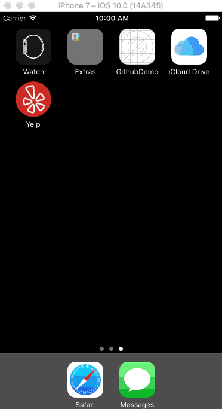

# codepath-hw2

**Yelp App** is a prototype of the Yelp app using the [The Yelp API](https://www.yelp.com/developers/documentation/v2/search_api).

Time spent: **20** hours spent in total

## User Stories

The following **required** functionality is completed:

- [x] Search results page
   - [x] Table rows should be dynamic height according to the content height.
   - [x] Custom cells should have the proper Auto Layout constraints.
   - [x] Search bar should be in the navigation bar (doesn't have to expand to show location like the real Yelp app does).
- [x] Filter page. Unfortunately, not all the filters are supported in the Yelp API.
   - [x] The filters you should actually have are: category, sort (best match, distance, highest rated), distance, deals (on/off).
   - [x] The filters table should be organized into sections as in the mock.
   - [x] You can use the default UISwitch for on/off states.
   - [x] Clicking on the "Search" button should dismiss the filters page and trigger the search w/ the new filter settings.
   - [x] Display some of the available Yelp categories (choose any 3-4 that you want).
   
The following **optional** features are implemented:

- [x] Infinite scroll for restaurant results.
- [x] Implement a custom switch instead of the default UISwitch.

## Video Walkthrough 

Here's a walkthrough of implemented user stories:

GIF created with [LiceCap](http://www.cockos.com/licecap/).

## Notes

I got stuck on the filters page, trying to make the list drop down or make the other distance switches hide. I also got stuck trying to make the filters app pop up modally. The code was simple but implementing this in Swift 3, I didn't have the right method for it so it wasn't triggering and it took me some time to debug.

I also got confused while trying to find and alter methods to create the functionality I wanted versus understanding that the item was something that I could get functionality in a cocopod, etc. I understood the individual parts but not always how they fit together. Nonetheless, it was a good introduction to Swift.

## License

    Copyright [2016] [Shola Oyedele]

    Licensed under the Apache License, Version 2.0 (the "License");
    you may not use this file except in compliance with the License.
    You may obtain a copy of the License at

        http://www.apache.org/licenses/LICENSE-2.0

    Unless required by applicable law or agreed to in writing, software
    distributed under the License is distributed on an "AS IS" BASIS,
    WITHOUT WARRANTIES OR CONDITIONS OF ANY KIND, either express or implied.
    See the License for the specific language governing permissions and
    limitations under the License.
    
    
